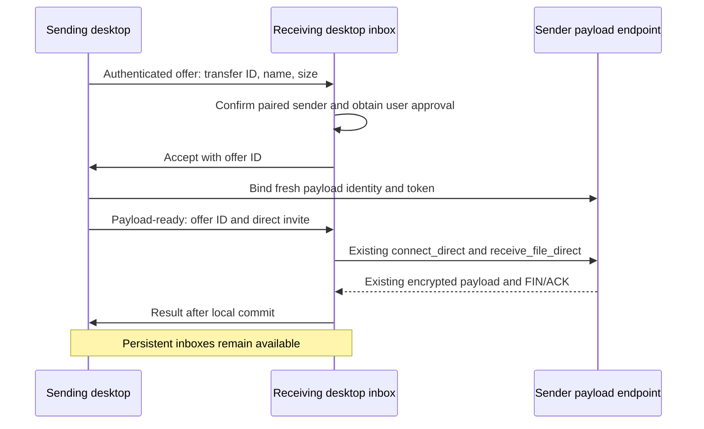

# Direct transfer optimization and desktop implementation plan

Status: efficiency milestone complete on 2026-10-03; desktop and pairing work stopped at the user's request. See the [efficiency report](direct-transfer-efficiency-report.md).
Prepared: 2026-09-29 against repository commit `4ba7b01`.

## Objectives and release boundary

Deliver these milestones in order:

1. Optimize verified direct transfers, using measurements to choose small changes.
2. Add a desktop GUI and tray process that reuse the existing transfer engine.
3. Add device pairing, an incoming-transfer listener, and file-manager context-menu sending.

The Firefox extension is already submitted to AMO and awaiting approval. Release
0.1.0 is in preparation. Preserve that release's artifacts, extension identity,
native-messaging interface, CLI behavior, and payload protocol. Develop this work
in subsequent changes; do not make the pending release depend on desktop work or
silently replace its submitted extension. Assign later release versions when the
milestones are ready, independently of the submitted extension's version.

This plan excludes smartphone apps, folders/archives, cloud storage, offline
delivery, relay throughput optimization, automatic trust of contacts, a system
daemon, and multiple simultaneous payload transfers. Several selected files can
eventually form a sequential queue of existing single-file transfers. Windows is
the first desktop integration target; keep shared code portable and retain the
existing Linux/macOS CLI and Firefox builds.

Direct means the **file payload travels on an IP path between peers**. The
existing `send --direct` selects invite-based authentication and bypasses the
rustytransfer backend; it does not disable Iroh relays. Discovery/connection setup
and payload routing are separate. The optimization milestone does not change the
normal product's fallback behavior or promise offline LAN discovery.

## Existing architecture to preserve

| Location | Responsibility and planned reuse |
| --- | --- |
| [`crates/crypto`](../crates/crypto) | PAKE, KEM, MAC, and streaming encryption. Keep algorithms and nonce rules. |
| [`crates/protocol`](../crates/protocol) | Sender/receiver FSMs, authenticated lengths, resume negotiation. Keep existing payload wire format. |
| [`crates/transfer`](../crates/transfer) | Transport-independent file I/O, verified-prefix resume, completion states, output commit, progress, metrics. Remains the payload engine. |
| [`crates/native`](../crates/native) | Iroh/WebRTC adapters, identity files, rendezvous/signaling. Add narrowly scoped native session and device services here. |
| [`src/cli`](../src/cli) | Arguments, terminal presentation, metrics serialization, current contacts. Retain the CLI as an independent frontend. |
| [`crates/firefox-host`](../crates/firefox-host) | File dialogs and native-messaging adapter. Keep its current process lifecycle and JSON interface. |
| [`extension/firefox`](../extension/firefox) | Plain HTML/CSS/JavaScript UI. Reuse conventions, without requiring changes to the submitted add-on. |
| [`benchmarks`](../benchmarks) and [`tests/local_transport_regressions.rs`](../tests/local_transport_regressions.rs) | Existing benchmark runners, JSONL records, summaries, local transport tests. Extend these rather than creating a second harness. |

The root library is a compatibility facade. New desktop code should depend on
the native and transfer crates directly, as the Firefox host already does.
Shared services must not depend on Tauri, browser APIs, `rfd`, terminal UI, or the
root CLI. Use the workspace's Rust edition, dependency declarations, error types,
Tokio patterns, and Clippy policy. Add one desktop crate; a new generic service
crate, event bus, plugin system, or application framework is not needed initially.

## Milestone 1: optimize direct transfers

### 1A. Establish a reproducible current baseline

Existing results are historical evidence, not a baseline for the current commit.
The [matched Oracle direct measurements](../benchmarks/README.md#oracle-validation-2026-09-21)
reported 27.175 MiB/s for 512 MiB, 13.49 sender CPU seconds, 7.82 receiver CPU
seconds, and about 37.6 MiB sender peak RSS. They used three measured runs and
different earlier code. The [read-ahead experiment](../benchmarks/README.md#phase-4-status-2026-09-21)
failed its WAN performance gate. Do not restore a pipeline or add parallel QUIC
streams without a new profile and a specific hypothesis.

Start with [`run_oracle_transfer.py`](../benchmarks/run_oracle_transfer.py),
[`summarize.py`](../benchmarks/summarize.py), and
[`performance-v1.schema.json`](../benchmarks/performance-v1.schema.json). Make only
the runner changes needed to measure the requested path correctly:

- Add invite-based send/receive support. The current Oracle runner waits for a
  short PAKE share code and uses the rendezvous backend even in its direct-path
  mode. Keep the existing mode available as a compatibility case. Label pairing
  mode separately from data path in results, and redact full invites from logs.
- Allow both WSL-to-Oracle and Oracle-to-WSL runs. The committed runner currently
  launches only a local sender. Associate resource records with actual sender and
  receiver roles, regardless of which machine launches them.
- Make Croc paths/checks conditional for `--rusty-only`; currently those binaries
  are required even in that mode. The main comparison is baseline versus candidate
  rustytransfer. Croc is an optional reference, not a reason to change host ingress.
- Read actual size/chunk settings from endpoint metrics instead of hardcoding
  256 KiB in generated rows. Preserve unique result directories and old raw data.
- Support smaller startup cases and a larger streaming case when resources permit;
  retain 64 MiB and 512 MiB as the common comparison sizes.
- Group summaries by build/candidate, direction, host pair, pairing mode, storage
  class, and path. The current summarizer does not distinguish several of these;
  never merge different experiments into one median accidentally. Validate actual,
  non-null matching hashes, rather than accepting two missing hashes as equal.
- Preserve v1 records when adding optional metadata. Omit absent optional fields
  when their schema disallows `null` (notably `transport_mode`); update schema and
  summarizer together if introducing a genuinely incompatible record format.

`RUSTYTRANSFER_BENCH_WAIT_DIRECT=1` waits for an initial direct path. Start/end
samples alone cannot detect an intermediate relay excursion. The pinned Iroh 1.2.0
API exposes `Connection::path_events()` and per-path statistics, including counts
of QUIC STREAM frames. Add a bounded, benchmark-only observer around the payload
interval: record selected-path changes and relay-path STREAM-frame deltas,
including final statistics for paths that close. A lagged event stream or missing
statistics makes the run unverified. For strict no-relay results, use that path
evidence or a controlled relay-disabled fixture with explicit peer addresses. If
only polling is available, label that limitation and do not claim it proves zero
relayed payload. Exclude relay, mixed, unknown, and unverified routes from the
direct-only acceptance set; retain failure records. Do not silently continue with
a relayed measurement when a direct route fails.

| Scenario | Purpose and minimum measurements |
| --- | --- |
| In-memory transfer tests and a focused local profile | Separate encryption, copies, allocation, and file-I/O costs from network limits. |
| Separate local processes, 64/512 MiB | Throughput, endpoint CPU, endpoint RSS; declare source/output filesystem and cache policy. |
| Actual two-machine LAN when available | Identify local network/storage limits; loopback and WSL are not substitutes for a physical LAN. |
| Oracle direct, both directions, 64/512 MiB | ARM64 versus local-host behavior, WAN throughput, CPU per GiB, RSS, connection/setup cost. |
| Small file, e.g. 4 KiB | At least ten runs; setup-to-completion median and tail latency, separately from payload rate. |
| Interrupted 512 MiB transfer | Verified resume, saved-prefix hashing cost, successful completion without resending accepted bytes. |

For the main streaming comparisons, use release builds, identical deterministic
incompressible inputs, one warm-up and at least five measured runs **per variant,
size, direction, and route**. Alternate baseline and candidate order. Compute full
output size/SHA-256 outside the timed interval. Report medians, extrema, MAD,
handshake/payload/shutdown time, CPU seconds per GiB, and per-endpoint peak RSS.
Record commit, dirty state, binary hash, toolchain, architecture, chunk size,
storage class, path evidence, and run identity. Measure instrumentation overhead;
use diagnostic builds for profiling and equivalent release builds for A/B results.

The existing local test contains both endpoints in one process; its RSS is not
per-endpoint RSS. Keep it for regressions and throughput checks, and use separate
processes for resource gates. Refresh native Windows measurements before claiming
benefits for Windows desktop users; WSL measurements describe a different I/O path.

### Oracle access and benchmark discipline

Read-only preflight on 2026-09-29 confirmed:

- Host: `ubuntu@141.147.1.21`, reachable through the Ubuntu WSL distribution.
- Existing key: `~/.ssh/id_ed25519_oracle` inside WSL; keep it there.
- Remote platform: Linux `aarch64`; one online logical CPU.
- `/usr/bin/time`, `perf`, `python3`, and `sha256sum` are present. Profiling
  permissions and tool compatibility still need checking.
- Remote `/tmp` is a roughly 2.9 GiB tmpfs. Do not report tmpfs results as disk
  throughput or fill it with several simultaneous large benchmark copies.

Example read-only access check, run inside WSL:

```sh
ssh -i "$HOME/.ssh/id_ed25519_oracle" \
  -o BatchMode=yes -o StrictHostKeyChecking=yes -o ConnectTimeout=10 \
  ubuntu@141.147.1.21 uname -sm
```

Use a dedicated remote directory such as
`/home/ubuntu/rustytransfer-bench/<run-id>` and a WSL-native local filesystem for
the primary measurements. Record actual filesystems; compare `/mnt/c` or tmpfs
only as separate experiments. Build/package only the CLI and required native
dependencies for Oracle, never the desktop GUI. Retain baseline and candidate
binaries separately and record their hashes. Check free space and CPU load first;
one remote CPU means compiling or profiling concurrently can invalidate timings.

Run bounded jobs, track endpoint PIDs, and stop only processes created by the
runner on timeout. Killing the local SSH process alone is not a reliable remote
cleanup strategy. Remove only recorded files beneath the validated benchmark
directory. Preserve failed-run diagnostics, redact credentials/invites, and keep
keys outside artifacts. No changes to Oracle firewall, global network settings,
system packages, or existing services are needed for this planning preflight.
If direct connectivity cannot be established during implementation, record that
limitation and inspect the route before considering scoped host changes.

### 1B. Profile, then make one small optimization at a time

Inspect the existing sender/receiver loops, Iroh framing, and streaming AES-GCM:

- [`session/sender.rs`](../crates/transfer/src/session/sender.rs) reads into a
  reusable buffer, then allocates a plaintext vector and copies each chunk before
  in-place encryption. First experiment: read directly into the owned chunk with
  tag capacity, avoiding that copy without changing `TransferTransport` or FSM
  signatures. Preserve short reads, EOF handling, and nonce/chunk limits. Buffer
  recycling or transport API changes require additional measured benefit.
- [`session/receiver.rs`](../crates/transfer/src/session/receiver.rs) writes each
  decrypted chunk. Measure file-I/O/blocking-pool and write costs before adding
  buffering. Preserve flush, durable commit, cancellation, and resume behavior.
- [`transport/iroh.rs`](../crates/native/src/transport/iroh.rs) allocates framed
  receive buffers and performs header/payload writes. Measure allocator and send
  wait costs before changing framing or batching. A no-op flush removal is not
  evidence of a throughput improvement.
- Profile AES-GCM and CPU feature selection on both x86_64 and ARM64. Do not
  weaken encryption, bypass authentication, or ship host-specific CPU flags in
  portable release binaries. Keep x86/ARM and profiling/release comparisons separate.
- Revisit chunk sizes or progress callback frequency only if the profile points
  there. Existing defaults are 256 KiB for Iroh and 8 KiB for WebRTC. Account for
  actual short-read chunk sizes, not only configured capacity.

Proposed acceptance gate for each candidate: either at least 5% better median
direct throughput or at least 10% lower CPU per GiB on its target scenario,
confirmed in a second series. No unexplained regression above 3% in the other
representative direct cases, no material RSS/startup regression, and no correctness
regression. If variance obscures the result, increase the sample count or reject
the claim. Keep these thresholds visible in the experiment record; an exception
needs measured justification, not an unrecorded change to the gate.

Completion means a reproducible current baseline, profiles identifying the
limiting costs, accepted or rejected experiments with evidence, and a rerun of
the final candidate on the agreed matrix. It does not require an unsupported claim
that the transport is universally optimal. If the remaining limit is network or
storage capacity, document that result. The user's 2026-10-03 instruction is to
stop after efficiency work; desktop functionality requires a later continuation.

### 1C. Regression coverage

Run affected crate tests plus `cargo test --workspace --locked` and the existing
Clippy/SARIF and dependency checks. Keep local Iroh/WebRTC shutdown regressions,
empty files, chunk boundaries, short reads, truncation/tamper rejection, wrong
authentication, prefix mismatch/reset, retry exhaustion, and committed-output
semantics covered. Add tests only for newly introduced behavior or plausible
regressions. Test old/new CLI and unchanged Firefox-host interoperability for any
shared payload changes. Do not turn WAN throughput into a flaky per-PR CI gate.

## Milestone 2: shared native session API and desktop GUI

### 2A. Extract only what the third frontend needs

Introduce a small [`native::direct`](../crates/native/src/direct.rs) module, with a shared invite type and direct
session functions. Move the duplicated CLI/Firefox parsing and formatting, retaining the
exact `rt1:` representation and validation behavior. Consolidate retry eligibility,
four-attempt policy, 1/2/4-second backoff, and direct reconnect behavior from the
CLI and Firefox host. Keep PAKE/rendezvous orchestration in the CLI until another
frontend actually needs it.

The shared API takes selected paths, transfer settings, an injected cancellation
signal, and progress/state callbacks. It returns existing metrics and structured
errors. It does not choose files, print output, show dialogs, or install handlers
for process-wide Ctrl+C. Use bounded channels for commands/events and coalesce
progress updates; completion/error events must not disappear behind a full
progress queue. Use existing `watch`/`mpsc` patterns rather than new async plumbing.

Cancellation must stop work and release file locks before reporting completion of
the cancel action; preserve partial files and honor `CompletionState` when deciding
whether retry is allowed. Do not retry confirmed transfers or convert a committed
file into a failed transfer because of a later cleanup diagnostic. Preserve the
CLI's exit codes and metrics and Firefox's existing request IDs/event shapes.

Migrate adapters in small steps: shared invite/policy first, direct driver second,
then desktop consumption. Preserve differences in UI behavior intentionally;
characterize any retry-classification differences before consolidation. Do not
move whole command handlers or browser state into the native crate.

### 2B. Add a thin desktop shell

Proposed new workspace member: `crates/desktop`, package
`rustytransfer-desktop`. Use Tauri 2 with local plain HTML/CSS/JavaScript assets
under `desktop/`. Reuse the extension's visual conventions and native dialogs;
do not introduce a frontend framework or shared UI package just for three views.
Keep dependency versions in workspace declarations and lock the selected versions.

Tauri commands adapt to `native::direct`; file bytes, secrets, filesystem policy,
and transfer work stay in Rust. Display progress, errors, retry state, speed, and
completion using small typed events. Load only bundled UI assets and grant only
the Tauri capabilities actually used. The first GUI supports the existing
send/copy-invite and paste-invite/receive workflows before device pairing exists.

The same desktop process owns its workers and tray icon. Closing the window hides
it while work continues; Quit stops new work, cancels/joins workers, closes the
listener when present, and exits. Offer startup at login as an explicit preference.
There is no separate privileged service or HTTP localhost server. Use the
[Tauri single-instance plugin](https://v2.tauri.app/plugin/single-instance/) to
forward subsequent launches into the running app; do not build another IPC layer
for this purpose. The existing Firefox native host remains independent.

The always-listening paired-device inbox arrives in milestone 3A; before that,
the tray app can continue active invite transfers and manually started receives.
Do not present milestone 2 as already supporting unsolicited paired-device sends.

### 2C. Account for CI and packaging when adding the crate

The current workflows explicitly use `--workspace`, and Clippy also uses
`--all-features`. `default-members` or an optional GUI feature alone will not keep
Tauri out of those jobs. Add the [documented native prerequisites](https://v2.tauri.app/start/prerequisites/)
to every affected build/test/Clippy/release-verification job when adding the
workspace member. Keep shared core tests runnable headlessly. Audit the Clippy
finding baseline through the existing workflow; do not blanket-suppress new code.

Retain package-specific CLI/Firefox release builds and add desktop packaging as a
separate later artifact/job. Do not make Oracle benchmark builds depend on desktop
system libraries. Validate Windows runtime packaging and clean installation first;
keep Linux/macOS workspace checks healthy and add desktop runtime smoke tests as
those packages become supported. Distinguish a successful build from tested tray,
dialog, and installer behavior on each operating system.

Milestone 2 is complete when two desktop instances on different machines can use
existing invites to exchange a file, interoperate with CLI/Firefox, resume after an
interruption, and cancel/quit cleanly. Reopening the GUI must reconstruct current
state without losing a transfer. Run native Windows direct-transfer performance
checks to ensure presentation does not materially slow the shared engine; measure
GUI process memory separately from the CLI endpoint RSS baseline.

## Milestone 3: paired devices and right-click sending

### 3A. Keep the persistent listener separate from payload endpoints

Use a small `native::devices` module for the device store and bounded request
protocol. The desktop process owns a persistent Iroh **control** endpoint with a
new ALPN, for example `rustytransfer/device/1`, and a separate persisted device
key. Keep the existing CLI/Firefox default identity file and behavior intact.
Do not publish two concurrently running endpoints under the same identity.

For each accepted file, retain the existing sender-listens/receiver-dials payload
flow using an ephemeral sender payload identity and a fresh per-transfer token:



Bind the payload endpoint after approval so the current 90-second accept timeout
does not expire while a human chooses a destination. Add a narrowly scoped helper
to bind a direct sender from a caller-provided key; retain that key and token only
in memory across the existing bounded reconnect attempts. Keep the payload
EndpointId stable during those attempts, then discard the transfer capability.

This avoids changing `IrohState::close_transport`, which currently closes its
entire endpoint, and avoids changing file-transfer FIN/ACK behavior. Never put the
persistent control endpoint into the current per-transfer `IrohState`. Defer
shared payload endpoints or pooled connections until measurements justify their
extra lifetime/shutdown complexity.

Use versioned, size-bounded control messages with explicit offer IDs and a small
state machine: offered, accepted/rejected, payload-ready, transferring, terminal.
Define deadlines for user approval, payload readiness, and inactivity. Allow one
active payload and a bounded set/queue of pending offers; return busy explicitly.
Cancel and revoke must invalidate pending offers. Authenticate the control peer
before exposing filenames or offers; correlate every response to peer and offer.
The independent payload endpoint is trusted only through the accepted control
offer and Iroh's verification of that offered EndpointId.

Treat the payload token as a temporary bearer capability, not device identity.
Reject duplicate completed/expired offers; allow only correlated retries of the
active offer. Reconnect attempts use fresh encrypted sessions with the current
verified-prefix resume. A lost control result after payload completion is an
unknown delivery status, not permission to resend or overwrite a committed file.
The desktop sender reports delivery confirmed only after the receiver reports
local commit. Preserve protocol-confirmed versus destination-committed states in
the UI instead of inferring a successful save from the payload FIN/ACK alone.

### 3B. Pair explicitly and preserve existing contacts

Store approved peers in a new versioned `devices.json` beside a separate desktop
device identity. Keep `contacts.json` version 1 unchanged. Its entries are names
and IDs, not permissions; importing a name never grants trust. Because the new
control identity differs from the legacy payload identity, existing contacts
still need the device's actual pairing invitation.

Pairing starts only in an explicit, time-bounded pairing mode. Exchange a fresh
high-entropy invitation containing the control EndpointId and a one-time secret
through the user's chosen channel. Authenticate the Iroh endpoint, prove possession
of the invitation, show device identities/labels, and require confirmation on both
devices before storing the peer's authenticated control ID. Labels alone never
establish identity. Specify invitation expiry, replay rejection, cancellation, and
partial-pairing recovery. Use established Iroh authentication and cryptographic
primitives already present; do not invent a new key exchange.

Store device trust atomically with per-user permissions. Provide rename and
unpair/revoke. Revocation immediately rejects new requests and clears pending
approvals from that peer; expose an explicit action to stop an already active
transfer. Start with accept-per-transfer; automatic acceptance is a later policy,
not an implicit effect of pairing. Device availability is advisory: a reachable
listener can receive, while a sleeping/exited laptop cannot. No offline delivery
or wake-up guarantee is introduced.
When the window is hidden, a notification opens the incoming-offer prompt; the
notification itself must not silently authorize a transfer. Prompt only for
authenticated paired devices and keep pending requests bounded.

Keep offer metadata small: basename, size, and correlation fields, never a remote
destination path. Reject path separators, traversal, platform-reserved names, and
unsupported file types; the receiver chooses the destination. Add an additive
receive option to compare the authenticated payload length with the approved
offer before resetting an existing partial or writing payload. Existing receive
functions remain wrappers with their current defaults; no payload wire change is
needed. Preserve no-overwrite behavior and same-directory resumable output.

Document the separate control-channel trust boundary. Reusing the current payload
encryption does not establish a new post-quantum guarantee for device pairing or
control metadata. Review pairing/control message handling and authentication
before enabling trusted-device sends in a public release.

### 3C. Add Explorer sending as a thin entry point

First add a desktop command such as:

```text
rustytransfer-desktop send -- <absolute-file-path> [additional-file-paths...]
```

Use native OS argument handling and `PathBuf`; never compose a shell command from
filenames. Resolve received paths against the invoking process's working directory
before forwarding them, and preserve Unicode and spaces. A later launch forwards
the selection to the running app. The app validates ordinary files, shows the
paired-device picker, and routes the selection through the same offer/session API.
Keep the shell entry point unaware of networking, identities, and transfer tokens.

Start with one active file. Support multiple selected files as a bounded sequential
queue, each with its own offer/token/output and result. Unsupported directories
get a clear message; do not silently zip or add a new batch wire protocol. No
separate CLI-to-daemon protocol or `send --to` implementation is required to ship
the desktop experience; those can later call the same native services.

Ship a static **Send with RustyTransfer...** Explorer action opening that picker.
This delivers right-click sending without maintaining a dynamic device list
inside Explorer. On Windows 11, the modern context menu requires
[`IExplorerCommand` registration with app identity](https://learn.microsoft.com/en-us/windows/apps/desktop/modernize/integrate-packaged-app-with-file-explorer).
Use a small native adapter that only forwards the selection; keep Explorer calls
fast and independent of network state. Validate packaged or external-location
identity registration in a focused installer spike. A classic menu entry can be
an explicitly labeled interim step, but is not completion of modern-menu support.

Integrate registration, update, and removal into the desktop installer. Test clean
install, upgrade, uninstall, app already running, app not running, multi-selection,
missing files, spaces/Unicode/leading-dash names, offline peer, and cancellation.
Keep the desktop shell optional for existing CLI/Firefox installations. Finder and
Linux file-manager integrations are follow-ups using the same command, not separate
transfer implementations.

Milestone 3 is complete when two paired desktops can send via Explorer, the
receiver can accept with its main window hidden, and repeated sends survive
completion/cancellation without losing the inbox listener. The unchanged invite
workflows must still work while the desktop process is running.

## Incremental pull requests and completion gates

| PR | Smallest useful deliverable | Gate |
| --- | --- | --- |
| 1 | Extend existing runner for current invite/direct baselines and provenance. | Both directions measured; direct-path proof/limitations explicit; hashes and resource roles correct. |
| 2+ | One profile-backed payload optimization per PR. | Numerical gate, correctness suite, retained baseline/candidate evidence; failed experiments leave no product complexity. |
| 3 | Shared direct invite and retry policy. | CLI/Firefox fixtures and interfaces unchanged. |
| 4 | Shared cancellable direct session driver in native. | Both existing adapters use it; retries, cancellation, completion semantics preserved. |
| 5 | Thin desktop GUI/tray and CI prerequisites. | Existing invite workflow, single instance, reopen/quit, Windows runtime and core regression checks. |
| 6 | Device control listener, ephemeral payload binding, offer acceptance. | Test-only peers can send repeatedly; completing or aborting a payload never closes the inbox. |
| 7 | Pairing store/ceremony, revocation, receive constraints, device picker. | Unknown/revoked/replayed requests rejected; approved metadata enforced; old contacts untouched. |
| 8 | Context-menu command, bounded multi-selection queue, installer registration. | Real Explorer install/update/uninstall and end-to-end paired transfer. |

PRs 6 and 7 may be reviewed separately but must ship together before enabling the
paired-device listener for users. The numeric order is illustrative; each payload
optimization may add a PR without forcing unrelated refactors into it.

For desktop/device work, add focused tests for listener lifetime, rejected offers,
timeouts, stale events, mismatched offered/header lengths, revoked devices,
reconnect to the correct offer, queue limits, and cancellation releasing locks.
Keep parser/state-machine tests in the owning crate and use the existing memory
transport/local Iroh fixtures where possible. Exercise protocol/network behavior
headlessly and UI/installer behavior on real supported desktops. Use the existing
workspace checks, wasm check, extension lint, Clippy/SARIF baseline process, and
dependency scans; update CI intentionally as the workspace grows.

At each merge, update this plan's status and link the relevant benchmark summary
or validation record. Completed work means demonstrable behavior and recorded
evidence. Unavailable LAN hardware, profiling permissions, signing credentials,
or platform testing are named limitations, never reported as passed checks.

## Execution notes

- 2026-09-29: Created `feature/direct-transfer-desktop` from `4ba7b01` to keep
  the pending Firefox/0.1.0 work separate. Began extending the existing Oracle
  runner for direct invites and accurate provenance. The first seven focused
  Python runner checks passed in WSL before the first remote smoke.
- 2026-09-29: Built the current CLI in WSL release mode, binary SHA-256
  `677af53572444003880c4f6413cd0ea6364ff3bf919eb5fa3286cd7d43566e6e`.
  A 1 MiB local two-process direct-invite smoke transferred identical SHA-256
  bytes; both endpoint metrics reported `path=direct`. This is functional evidence
  only: start/end route sampling does not prove every payload byte avoided relays.
- 2026-09-29: Created deterministic incompressible AES-CTR benchmark inputs on
  WSL's native filesystem at `/home/wasilij/rustytransfer-bench/`. The 64 MiB
  source SHA-256 is `b657d87cf92612db23f505549e6c37206c46160c77ed3f40dcc153b6625883bf`;
  the 512 MiB source SHA-256 is
  `30671134dac585f880ff30d0a898cba69535339855bd938ef68585a8d142c1de`.
  Both use an all-zero AES-256-CTR key and IV over zero input; the 64 MiB file is
  the prefix of the larger one. These are benchmark fixtures, never transfer keys.
- 2026-09-29: Read-only Oracle preflight reached the ARM64 host. Its existing
  RustyTransfer binary predates the current checkout, and the default non-login
  shell had no `cargo`/`rustc` in `PATH`. Installed the 1.97.0 Rust toolchain in
  the `ubuntu` user's home and completed a matched ARM64 release build from a
  `git archive` of `4ba7b01` under `/home/ubuntu/rustytransfer-bench/source-4ba7b01`.
  The ARM64 binary SHA-256 is
  `c182c23fdc5b9f2d157b2e525f6c12b71141e6a9b1151496c3fc4fd6003de022`.
  The toolchain and source are user-local; previous binaries and measurements
  remain untouched. Oracle's `perf_event_paranoid=4` currently prevents normal
  user-space `perf` sampling, so obtain an available profiling method before
  claiming a CPU flamegraph.
- 2026-09-29: The direct-invite runner completed one warm-up and one measured
  64/512 MiB transfer in each Oracle direction, with full output size and
  SHA-256 checks passing. The 512 MiB measured rates were 5.287 MiB/s
  WSL-to-Oracle and 21.519 MiB/s Oracle-to-WSL. Raw rows and provenance are in
  [`oracle-20260929-invite-smoke`](../benchmarks/results/oracle-20260929-invite-smoke/README.md).
  This is smoke evidence only: one sample per case and start/end path labels
  do not establish a verified direct-route optimization baseline.
- 2026-10-01: Added benchmark-gated Iroh payload path evidence using per-path
  STREAM-frame deltas and path events. The runner now requires both endpoints
  to verify a direct route, records candidate/binary/direction/storage
  provenance, and stops a direct-only sweep after retaining an invalid row.
  `cargo test --workspace --locked`, 26 Python benchmark tests, and formatting
  checks passed. A local 1 MiB direct-invite transfer and a two-machine
  64/512 MiB smoke in both directions verified direct payload paths and matching
  hashes. See [`oracle-20261001-invite-strict-smoke`](../benchmarks/results/oracle-20261001-invite-strict-smoke/README.md).
  Its one measured run per case is not the five-run comparison baseline.
- 2026-10-02: Completed one warm-up plus five measured 64/512 MiB trials in
  both directions on frozen `a49fa18` release binaries. All 48 endpoint rows
  had matching output hashes and verified direct payload paths; eight measured
  endpoint groups have five samples each and no rejected rows. The 512 MiB
  median rates were 5.633 MiB/s WSL-to-Oracle and 21.443 MiB/s Oracle-to-WSL.
  See the [baseline evidence](../benchmarks/results/oracle-20261002-invite-strict-baseline/README.md)
  for build hashes, phase/resource statistics, storage policy, and limitations.
  An interrupted earlier sweep remains preserved and excluded. Payload stage
  profiling is the next step; no optimization claim has been accepted.
- 2026-10-02: Added opt-in payload-stage elapsed timings without stage clock
  calls when disabled. The existing runner preserves profiles, validates
  bytes/chunks/timing consistency, and separates diagnostic runs in summaries.
  Reverse trials may use pre-staged inputs verified before each trial; these
  caller-owned sources are never removed. Workspace tests, wasm check, formatting,
  34 Python checks, workspace Clippy/SARIF with the three existing findings,
  identity/report gates, and cargo-deny workspace checks passed. Built matching
  diagnostic binaries from Rust source archive SHA-256
  `04f2756a5b2e554ee0f3ca0ae615014ec41c20ee207d1a82747c2f408f1ef01a`:
  WSL `56eeb3f97b0d8e69afc066de58edad15dfdfaca387770cd0644e36460b06d50e`,
  Oracle `f9c9e93debb8e985da9f0549bee5adb9d15858c19d66b303daf311a706c6985e`.
  Stage measurements and instrumentation-overhead checks are complete; see below.
- 2026-10-02: [WAN stage diagnostics](../benchmarks/results/oracle-20261002-payload-profile/README.md)
  passed all 16 endpoint records. Oracle encryption/decryption each took about
  10 seconds per 512 MiB; x86 sender copy/encryption took 0.41 seconds while
  send waits dominated. A [local profiling-overhead check](../benchmarks/results/local-20261002-profile-overhead/README.md)
  passed 40 measured transfers in two reversed-order series: median payload
  differences ranged from -2.56% to +1.48%, with no repeatable regression.
  Extended the existing local harness with strict route evidence, optional
  profiles, an Iroh filter, and safe removal of test-owned outputs between runs.
  Evaluating pinned AES/POLYVAL runtime ARM dispatch cfgs on Linux/macOS AArch64;
  no candidate optimization has passed its numerical gate yet.
- 2026-10-02: Consolidated direct invite parsing/generation and retry eligibility,
  attempt limit, and backoff in `native::direct`. CLI and Firefox consume the same
  primitives; the `rt1:` format, case acceptance, frontend interfaces, and their
  existing reconnect-error handling are preserved. Root/native/Firefox tests,
  formatting, wasm check, and exact workspace Clippy/SARIF gates passed with
  the three existing findings. Cancellable session orchestration remains unfinished.
- 2026-10-03: User narrowed the current execution to efficiency and asked to stop
  when that work is complete. Preserved unfinished shared-driver, desktop, and
  device drafts in the separate `feature/desktop-draft` worktree at
  `../rustytransfer-desktop-draft`; those drafts are unvalidated and are not part
  of the current workspace or a release. Resumed the interrupted ARM comparison
  with frozen, reverified binaries and inputs, fresh scoped run directories, and
  extra unscored warm-ups. The incomplete trial and its diagnostics remain
  excluded from accepted measurements. No pending AMO artifact was replaced.
- 2026-10-03: Accepted the Linux/macOS AArch64 runtime AES/POLYVAL Cargo cfgs
  after two reversed-order direct A/B series: 512 MiB Oracle CPU/GiB fell 54.3%
  sending and 23.7% receiving. The first forward 64 MiB series' -3.217% rate
  crossing remains visible with its measured, non-reproducing exception. Startup
  and real suffix-only 512 MiB resume checks passed. The final direct Oracle-to-WSL
  Croc 11.5.4 comparison measured 12.48/19.28 MiB/s at 64 MiB and 23.02/28.87
  MiB/s at 512 MiB (Rustytransfer/Croc). All hashes and direct-route checks passed;
  the temporary client-only instance firewall rule was restored exactly.
  See the [final report](direct-transfer-efficiency-report.md) and its raw evidence.
  No further desktop/device implementation is part of this execution.
